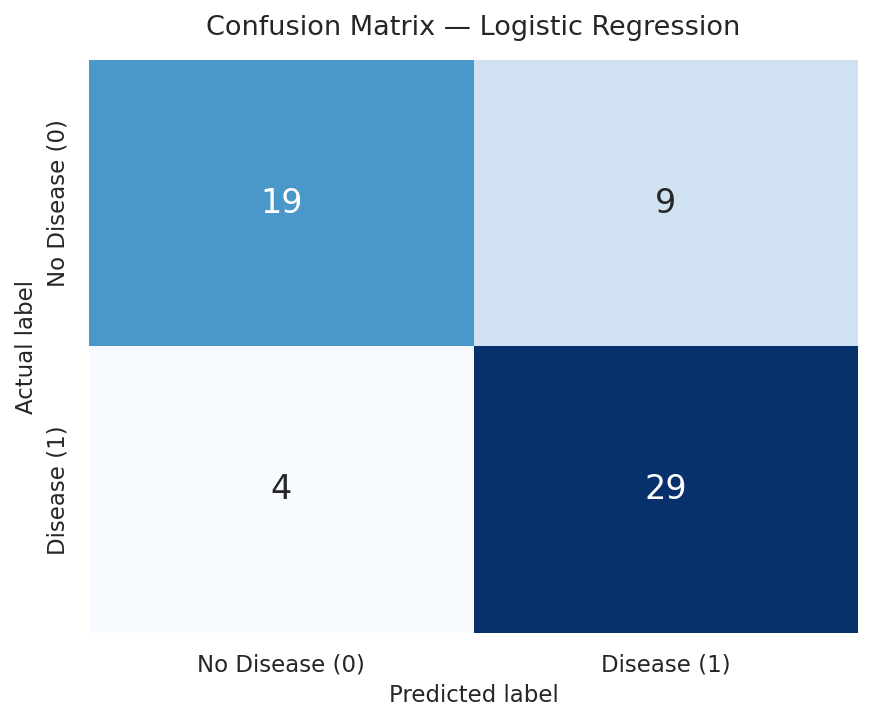
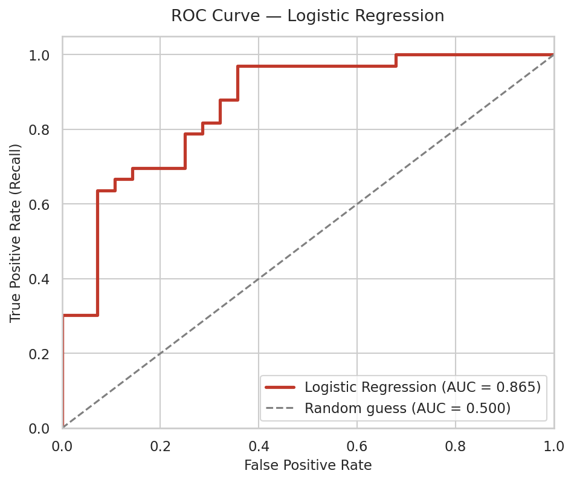

# Heart Disease Prediction — Week 4 Major Project (Capstone)

A beginner-friendly machine learning project that predicts whether a patient is likely to have heart disease, using the **Kaggle Heart Disease UCI** dataset and a **Logistic Regression** classifier.

The full pipeline — loading, cleaning, scaling, training, evaluation and visualisation — lives in a single notebook: [`heart_disease_prediction.ipynb`](heart_disease_prediction.ipynb).

---

## Objective

Build a classification model that takes 13 medical measurements from a patient and predicts:

- **1** → heart disease is likely to be present
- **0** → heart disease is unlikely

---

## Dataset

**Kaggle — Heart Disease UCI** (`data/heart_disease.csv`)

| | |
|---|---|
| Rows | 303 patients (302 after removing 1 duplicate) |
| Features | 13 |
| Target | `target` (1 = disease, 0 = no disease) |
| Class balance | 165 with disease / 138 without — roughly balanced |
| Missing values | None |

### Feature description

| Column | Meaning |
|---|---|
| `age` | Age in years |
| `sex` | 1 = male, 0 = female |
| `cp` | Chest pain type (0–3) |
| `trestbps` | Resting blood pressure (mm Hg) |
| `chol` | Serum cholesterol (mg/dl) |
| `fbs` | Fasting blood sugar > 120 mg/dl (1 = true, 0 = false) |
| `restecg` | Resting electrocardiogram result (0–2) |
| `thalach` | Maximum heart rate achieved |
| `exang` | Exercise-induced angina (1 = yes, 0 = no) |
| `oldpeak` | ST depression induced by exercise |
| `slope` | Slope of the peak exercise ST segment (0–2) |
| `ca` | Number of major vessels coloured by fluoroscopy (0–4) |
| `thal` | Thalassemia test result (0–3) |
| **`target`** | **1 = heart disease, 0 = no heart disease** |

---

## Workflow

1. **Load the data** — read `data/heart_disease.csv` into a pandas DataFrame.
2. **Explore** — inspect shape, data types, summary statistics and class balance.
3. **Clean** — check for missing values (none found), remove duplicate rows (1 removed), confirm all columns are numeric.
4. **Split** — 80% training / 20% testing, stratified so both sets keep the same class ratio (`random_state=42`).
5. **Scale** — `StandardScaler` fitted on the training set only, then applied to both sets (avoids data leakage).
6. **Train** — Logistic Regression (`max_iter=1000`).
7. **Evaluate** — Accuracy, Precision, Recall (plus F1 and a full classification report).
8. **Visualise** — Confusion Matrix and ROC Curve, both saved to `images/`.
9. **Conclude** — results table and feature-coefficient interpretation.

---

## Model

**Logistic Regression** was chosen because it is simple, fast, well suited to binary classification and — unlike a black-box model — its coefficients can be read directly to see which measurements push a prediction toward "disease".

---

## Results

Measured on the held-out 20% test set (61 patients):

| Metric | Score |
|---|---|
| **Accuracy** | **78.69 %** |
| **Precision** | **76.32 %** |
| **Recall** | **87.88 %** |
| F1-score | 81.69 % |
| ROC-AUC | 86.47 % |

### Confusion Matrix



| | Predicted 0 | Predicted 1 |
|---|---|---|
| **Actual 0** | 19 (True Negative) | 9 (False Positive) |
| **Actual 1** | 4 (False Negative) | 29 (True Positive) |

Only **4 sick patients were missed** out of 33 — the most important number in a medical screening context.

### ROC Curve



An AUC of **0.865** means the model separates the two classes far better than random guessing (0.500).

---

## Conclusions

- The model correctly classifies roughly **4 out of 5** patients on unseen data.
- **Recall (87.88%) is the standout metric** — the model catches the large majority of patients who actually have heart disease, which is exactly the behaviour you want from a screening tool. The trade-off is a slightly lower precision, meaning a few healthy patients get flagged for follow-up.
- The strongest positive predictors were chest pain type (`cp`) and maximum heart rate (`thalach`); the strongest negative ones were sex, `oldpeak`, thalassemia result (`thal`) and number of major vessels (`ca`) — consistent with known medical intuition.
- **Limitations:** the dataset is small (~300 patients), so scores shift with a different train/test split. Cross-validation, hyperparameter tuning and comparing other algorithms (Decision Tree, Random Forest) would be sensible next steps.

> ⚠️ **Disclaimer:** This is an educational project. It is not a medical device and must never be used for real diagnosis.

---

## Project Structure

```
week4-heart-disease-prediction/
├── data/
│   └── heart_disease.csv          # Kaggle Heart Disease UCI dataset
├── images/
│   ├── confusion_matrix.png       # Confusion matrix visualisation
│   └── roc_curve.png              # ROC curve visualisation
├── heart_disease_prediction.ipynb # Complete ML pipeline with outputs
├── requirements.txt               # Libraries needed to run the project
└── README.md                      # This file
```

---

## How to Run

**1. Clone the repository**

```bash
git clone https://github.com/<your-username>/week4-heart-disease-prediction.git
cd week4-heart-disease-prediction
```

**2. (Optional) Create a virtual environment**

```bash
python -m venv venv
source venv/bin/activate      # On Windows: venv\Scripts\activate
```

**3. Install the dependencies**

```bash
pip install -r requirements.txt
```

**4. Launch the notebook**

```bash
jupyter notebook heart_disease_prediction.ipynb
```

**5. Run all cells** (`Kernel → Restart & Run All`).

The notebook reads the CSV from `data/` and regenerates both images into `images/`. Run it from the project root folder so the relative paths resolve correctly.

---

## Requirements

- Python 3.8 or higher
- pandas, numpy, matplotlib, seaborn, scikit-learn, jupyter (see `requirements.txt`)
